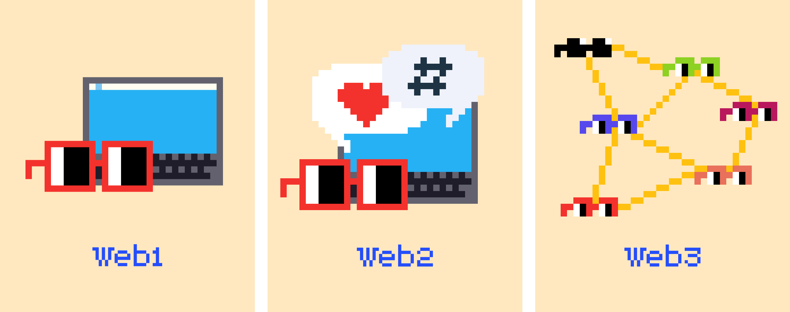

Blockchain is the backbone of [[Web3]].

Fundamentally, the blockchain is a database.

### The Details

Without it, cryptocurrency, NFTs, and DAOs would not exist (if you don’t know what these are yet, don’t worry! We’ll get there).

Fundamentally, the blockchain is a [[database]] and houses a ledger (or record) of transactions.
