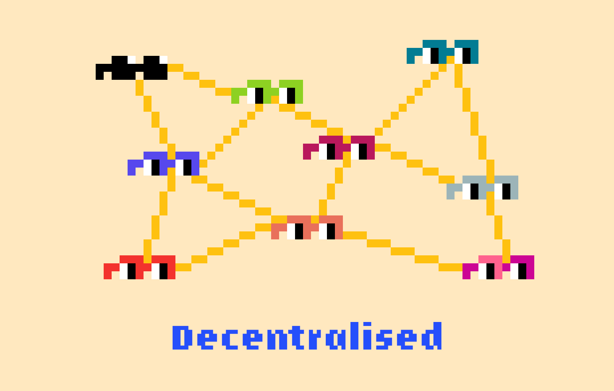

Cryptocurrency is an :intangible:, digital currency on the blockchain.

This means that crypto is not run by governments or banks. It’s run decentrally.

Cryptocurrency relies on [[blockchain]] technology to be secured, transferred, and created.

Without the blockchain, crypto would not exist. For that reason, cryptocurrency is a [[peer-to-peer (P2P) system]].

Cryptocurrency is [[stored]] on the blockchain, accessed via crypto wallets, and can be bought with [[FIAT]] on [[crypto exchanges]].

There are many kinds of cryptocurrency, residing on different blockchains. [[Bitcoin]], [[Ethereum]], and [[Solana]] are three popular crypto [[tokens]].

Some popular crypto [[exchanges]] include [[Coinbase]], [[Binance]], and [[Kraken]], among many others.

Before signing up for an exchange, it’s important to [[DYOR]].
