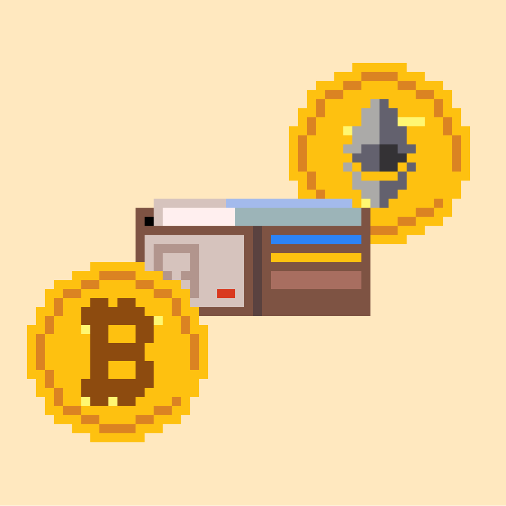

# Non-Custodial Crypto Wallets

As explained in the previous section, there are different types of wallets. After purchasing your crypto on an exchange, we suggest you store your crypto long term on a non-custodial wallet. A non-custodial crypto wallet helps you \[\[secure your crypto]].

Contrary to popular belief, crypto wallets do not store your crypto. They simply allow you to access your crypto.

Before we create your first non-custodial wallet, let’s explain how crypto wallets work…
